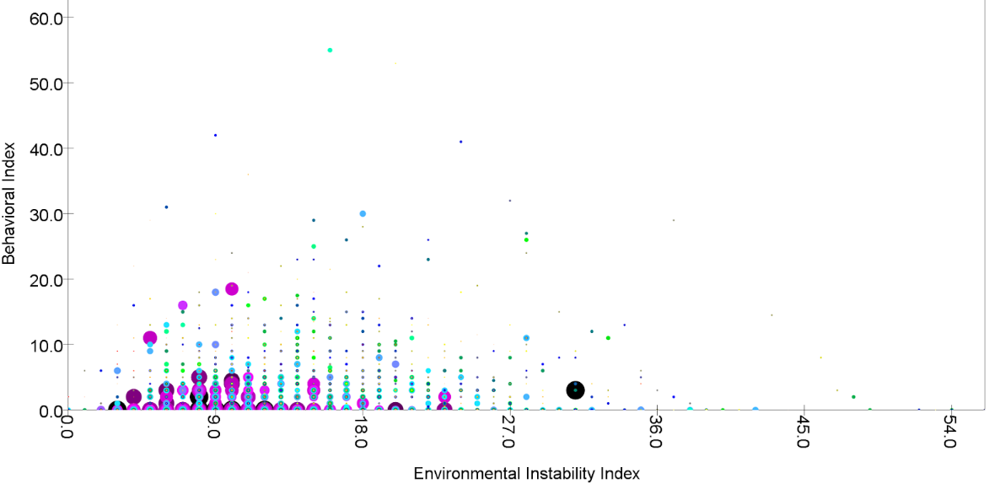

This dataset was produced by a study that found ~5,000 children born from 1998-2000 and conducted interviews with the children and their families. Each family was interviewed when their child was 0, 1, 3, 5, 9, and 15 years old. The study hoped to collect data that would reveal what factors of a child’s life are the most influential in the child’s wellbeing and life choices. Each “wave” of the interview collects a lot of specific data, like the condition of the house and neighborhood of the family, household income, health of the child, sexual activity of the child, and drug/substance use of the child, to name a few. 

The overall focus would be: how much does a child's environment and parental relationships affect their lifestyle choices? Is a child more likely to engage in risky behavior if their parents are less involved growing up? What if their home is "unstable," e.g. they frequently move to a new city? How much influence does income have? 

While more specific questions would be helpful, it is hard to ask them with this dataset. As mentioned earlier, the study collected very specific data. While this is a strength of the dataset, it is also a downside. Each data point is so specific, it is hard to do singular analysis on them. For example, at age 9 the parents are asked how many times the water or electricity was shut off in the last 12 months. At age 15, they ask the child if they have ever stolen anything more than $50. Using the number of times the utilities were shut off to predict how likely a child was to steal something over $50 does not sound like a promising, or helpful, question. Therefore, with this dataset, we have to keep our questions more general. I suppose you could use income as a predictor instead, but still: what does it mean if a 15 year old has or hasn't stolen something $50?

To grapple with the specificity of the dataset, I figured it would be best to pool together variables to represent a more general factor/aspect. The aspects I wanted to use were the child's environmental instability, the parents' involvement with the child, and the risky behavior of the child at age 15. For environmental instability, I used, for both mother and father, how many jobs they held in the past year for that wave, how many new partners they have cohabitated with, and how many times they have moved. These variables were compiled into a "score." The more unstable the environment, the higher the score. For parental involvment, I chose the variables for if the parents attended important events, if they discussed significant decisions with the child, how close the child felt to the parents, and how much time they spent with the child. The higher the score, the less involved the parents were. For risky behavior, the variables were getting stopped by the police, convictions or sentences to juvenille detention, drug use, and sexual activity. The higher the score, the riskier the behavior. Income was averaged across all the available income data for that parent. This method helps deal with a lot of the holes in the dataset. If a parent was absent from a wave, we at least still have a score for them based on the other waves. It also allows helps get away from the specificity of the dataset's questions -- we can identify risky behavior on more than just stealing something > $50. We still get to answer our original question as well, which is seeing how likely environmental and parental factors affects a child's behavior. 

Here is the correlation matrix. It wasn't as promising as I had hoped, but hopefully plotting it conveys more information. 

 

This is a good start. We can see that, at least in the extreme cases, there's a pretty obvious trend with income and behavior. Remember, a higher behavioral index means they had more signs of risky behavior. The riskiest child has an income <10000, and the indicies stay below 5 once the incomes are around 3000000. 

These two graphs are very surprising to me. I would have thought that less involved parents and more unstable environments lead to riskier behavior, but we actually see a bit of the opposite here in the extreme cases. To better explain this, I think it would good to visualize the income.

For both of these graphs, both size and color represent income. The black dots are > 500000, for reference. They are sorted so that the largest dots are in the deepest "layer" of the image. This is to help with the density of the bottom left corner. With the size and color, we can see families with same index scores but different incomes. 

I am surprised by the size of the dots on the bottom right corners of each graph. Despite the unstable environments or uninvolved parents and low income, those children did not engage in risky behavior. What isn't surprising is the lack of larger dots above a behavior score of 20. Overall, it is hard to walk away with a solid conclusion from these graphs. There just isn't that much consistency with the points, other than the large incomes being below a behavior index of 20. It doesn't help explain the opposite correlation we saw in the previous graphs, either. At the very least, it reveals how "normal" out data is -- i.e. there aren't that many edge cases. Almost all the points are in the bottom left corner. Without enough edge cases, it will be hard for any ML algorithms to predict really risky behavior. 

Next up was regression: 

 

Because of the random split, I ran each configuration about 5-10 times. Each run got pretty similar results. 

It's hard to gauge how effective this is, because we're using a mean squared error on a scale that is made up. 18 isn't necessarily bad but it's not necessarily good, either. I wouldn't recommend anyone use either the random forest or linear regression to try to predict risky behavior. 

Finally, I tried clustering. For these graphs, I used color for the cluster and size for the risky behavior index. Bigger size = higher index. With this setup, we want the larger dots to all have the same color. That would mean the riskier children were all put in the same group. 
k = 2

 

k = 3

 

k = 4

 

k = 6

 

Unfortunately, most of the large dots have different colors in every iteration. This means the cluster could not identify risky children. What's interesting, though, is how the clustering is more dependent upon parental involvement and environmental instability than it was income. We know this because the income-based graphs have a lot of overlapping clusters, but the environmental and parental graphs have distinct lines. This doesn't necessarily mesh with our other findings, which showed that income was the most correlated value. I don't know why it's doing this.

If we are to trust the data and my algorithms, we have learned that parental involvement and environmenal instability are not likely factors in a child's risky behavior. Income has more correlation, but not a whole lot. The next step, then, would be to explore other factors of a child's development. I think the idea of creating an index to represent multiple data points is a good idea, so for future studies I would apply the same methdology but for different aspects, like education quality. 

Overall, this dataset did not prove to be easily useful for machine learning. I think to truly produce some good models, you'd need to be knowledgable in both psychology and stats. Psychology will allow you to pick meaningful variables (and perhaps create more meaningful indices), and stats will help you pad the data. With only 5000 families, you don't have a lot of data. If you filter for people who weren't absent for an interview, that number goes down even more. I lost about 1500 families because the child did not participate in the 15 year interview. Hopefully a strong knowledge in statistics would help deal with this, as you can't really impute the missing values.  

It would be interesting to connect this dataset to geographic data, i.e. see where the riskier children lived or grew up. But due to confidentiality issues, the public data only contains the state of a family. It might be useful to pair a child with their state's general education quality, but I don't think that would work too well. Even if you live in the state with the worst education, you could still possibly go to a really good private school. On the other hand, it might be unnecessary to connect to other datasets. This one already contains so much detailed info, you could probably just use the data it's already collected. 