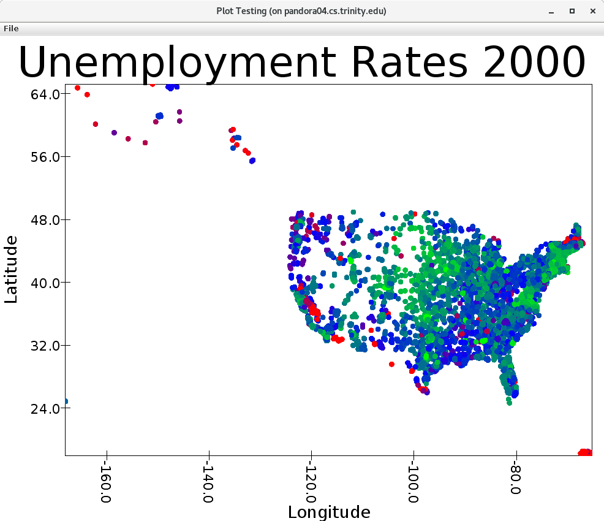
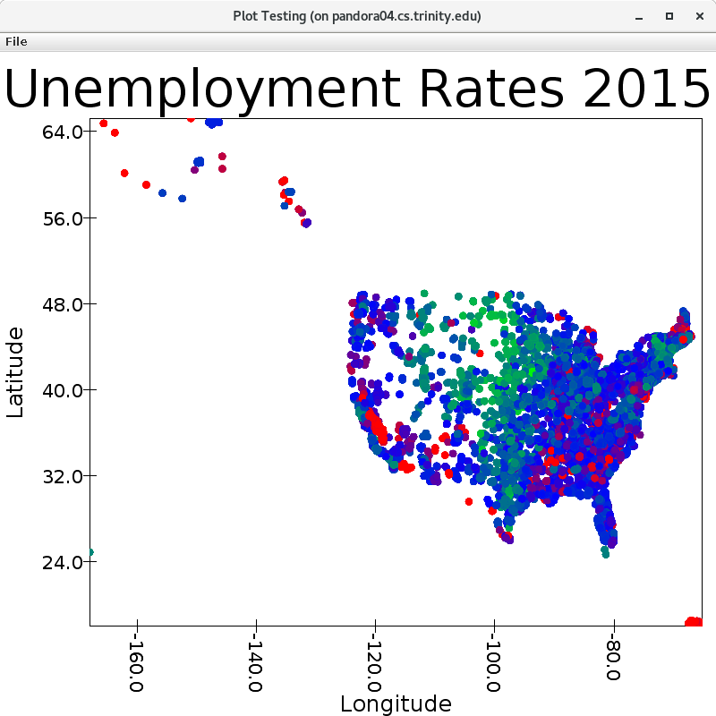

### 1) How many series does New Mexico have?

264 series (I am counting distinct series, not number of data inputs)

### 2) Max Unemployment Level

28461 units of unemployment

### 3) How many cities with >25k population in NM?

10 cities

## 4) Avg. Unemployment rate in NM 2017 

### A.

+------+---------+------------------+
|period|avg(year)|        avg(value)|
+------+---------+------------------+
|   M01|   2017.0|7.1909090909090905|
|   M02|   2017.0| 6.957575757575758|
|   M03|   2017.0| 6.612121212121213|
|   M04|   2017.0| 6.169696969696969|
|   M05|   2017.0| 6.095454545454547|
|   M06|   2017.0| 6.971212121212122|
|   M07|   2017.0| 6.872727272727273|
|   M08|   2017.0| 6.427272727272728|
|   M09|   2017.0| 6.133333333333334|
|   M10|   2017.0| 5.965151515151516|
|   M11|   2017.0| 6.042424242424242|
|   M12|   2017.0|  5.91969696969697|
|   M13|   2017.0| 6.449230769230769|
+------+---------+------------------+

### B.

6.56 units of unemployment rate

## 5 Cont. of 4

### A. 

Weighted average is 6.15 units of unemployment rate

### B. 

The BLS average is 6.2, suggesting my weighted average is more accurate than my plain average. This is makes sense since the

weighted average accounts for the size of a population, e.g. a population of 10000 is not treated the same as a population of

1 million. 

### 6) Max unemployment rate in Texas with labor force > 10k

54.1 units of unemployment rate (ouch). February, 1990, Rio Grande City, TX

### 7) Max unemployment rate anywhere with labor force > 10k

58.9 units of unemployment rate (ouch again), July, 2013, San Luis City, AZ

### 8) What state has the most distinct data series?

For this, I consider series_id with different measure codes as different series, e.g. 

LASBS060000000000003 is different from LASBS060000000000006

Maine, with 2296 units of distinct series

### 9)

I could not get the scatterPlotGrid to work, and no matter what I tried,

I could not filter out Alaska, Hawaii, or Puerto Rico. 

Rate of 9 is red, 6 is blue, 1 is green, across a gradient

