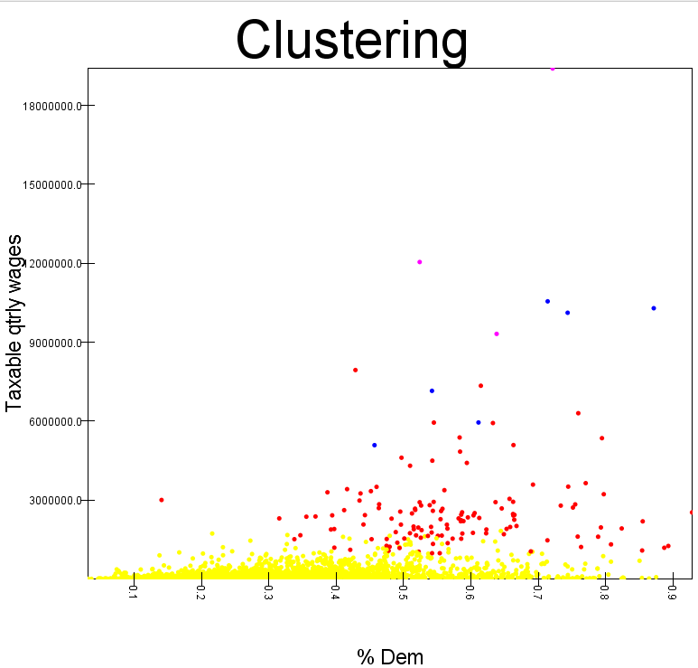
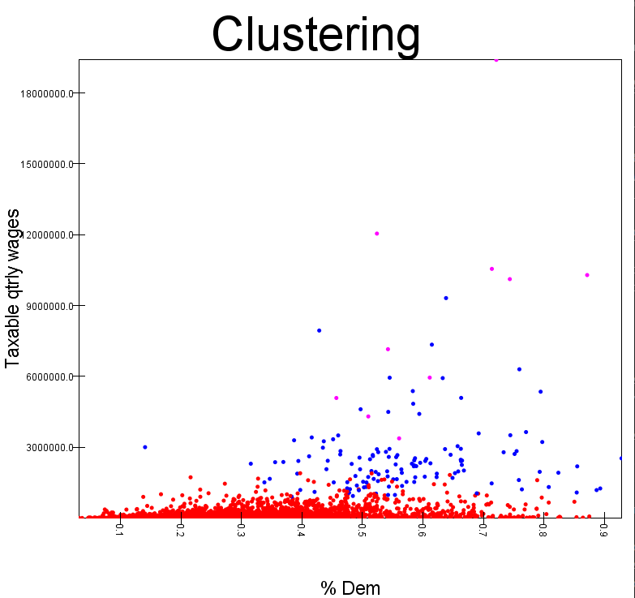
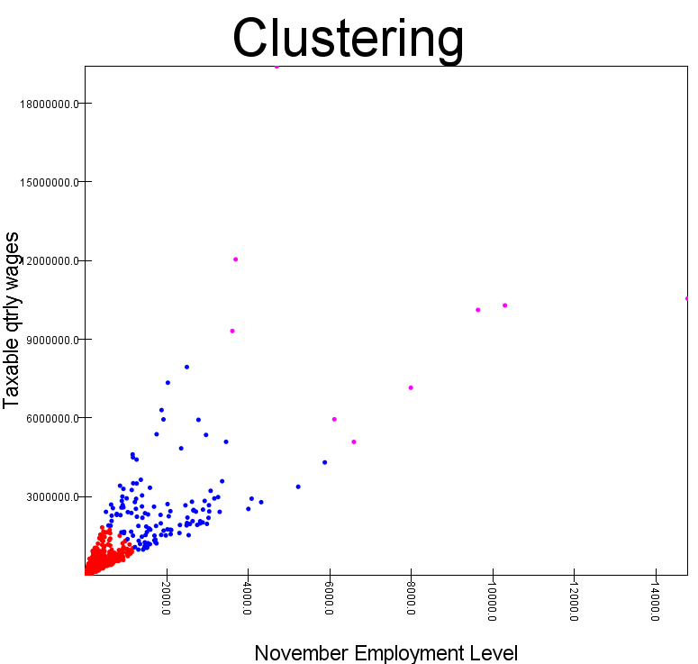

1. County level codes? How many entries?

    * Codes 70-78 are used for county-related data. 
    * 11470048 of these bad boys are county-related.
    * 78 has 3984876
    * 76 has 2162440
    * 72 has 76460
    * 77 has 3396052
    * 73 has 277932
    * 70 has 13084
    * 75 has 1100372
    * 71 has 51964
    * 74 has 406868

2. How many are for Bexar County?

    * 9244 entries for Bexar County

3. Three most common industry codes, number records for each 

    * Code 10 has 76952 entries
    * Code 102 has 54360 entries
    * Code 1025 has 40588 entries

4. Top wages

    * Elementary and secondary schools had $244321853090 in wages
    * Managing offices had $219387605630 in wages
    * General medical and surgical hospitals had $205806016743 in wages

5. Clustering

This is from clustering on the average total_qtrly_wages and average month2_emplvl from the fourth quarter of a whole county, i.e. each county has only one data point. I chose month2 and the fourth quarter so we have the unemployment level from November. This managed to get 87% of the counties properly clustered.

For the graph, I put per_dem on the x axis to see how well the clusters line up. I arbitrarily chose wages for the y-axis. Looking at the graph, it does not convey 87% accuracy at all. There is no clear break between the red and blue dots on the x axis. In fact, it almost looks like there are more red dots > 50% democratic than there are red dots < 50% democratic. This is a limitation of the graph; it does not show how dense the bottom left half of the graph is. Even though there are a ton of red dots in the > 50% democratic, we get 87% accuracy because there are so many more counties with wages < 50000000 that were a majority Republican. The number of counties with wages < 50000000 properly labled as republican vastly outweighs the number of counties with wages < 50000000 incorrectly labled republican.

It is interesting how most of the blue points are past 50% democratic and above $50000000 wages. I would guess that an average total wage above 50000000 comes from the larger cities, which we know lean democratic. Therefore we can conclude this clustering instance can detect large metropolitan areas as democratic, but struggles with a finer distinction for smaller towns/counties. Overall I would say using average total_qtrly_wages and month2_emplvl are not very helpful for predicting political outcomes, as this will only make predictions we already know are fairly certain. I think it's still cool, though,that it was able to detect big city vs. rural county. 

This is from clustering on average taxable_qtrly_wages and again average month2_emplvl. I figured the taxable_qtrly_wages may slightly help the clustering,as republican states may have less taxable wages. Unfortunately the QCEW website did not explain what, exactly, it meant by taxable wages, so this could be fairly similar to total wages after scaling. But if we look at the graph, we see a significant difference. This resulted in 88.5% accuracy. Although this was a 1% bump in accuracy, I think this shows an important improvement in clustering: it picks up on more of the counties that don't have huge wages. In the process it faslely categorizes some republican counties as democratic, so there is a downside.  

This is again taxable wages and month2 employment, but with 3 clusters. This was 88.9% accurate and looks fairly similar to the previous graph. The biggest difference is, with the third cluster, it can put really large cities in their own cluster (the magenta colored). 

This is with everything the same but 4 clusters. At this point, we don't have clusters that predict voting tendencies, we just have clusters that group by the taxable wage average. You can see this by the breaks throughout the y-axis: yellow is < 1500000, red is < 9000000 but > 150000, and blue and magenta are a jumble of > 6000000. We still get 87% accuracy, since the bottom left yellow is so dense. 

Therefore I would argue three clusters is the sweet spot, and the next thing to do would be find the variables the produce the best clusters.

For this I stuck with taxable wages and month2 employment, but added qtlry_estabs just to see if it would help. It didn't. 

Overall I don't think the QCEW data is helpful for predicting political tendencies. Based on the previous results, the wage data of a county simply isn't correlated enough with voting to produce reliable clusters. Furthermore, because the wage data has such a huge range, from small towns vs. huge cities, the clustering algorithm will have a hard time correclty predicting the in-between counties. Once you get to a fine enough detail to possibly handle that distinction, the algorithm ends up just clustering for wages and does little to predic political tendency. 

Just for funsies, here is clustering on taxable wages and month2_emplvl with 3 clusters, but I use the employment instead of per_dem for the x axis. This doesn't really provide any additional insight except for how the clusters were geometrically divided. 

