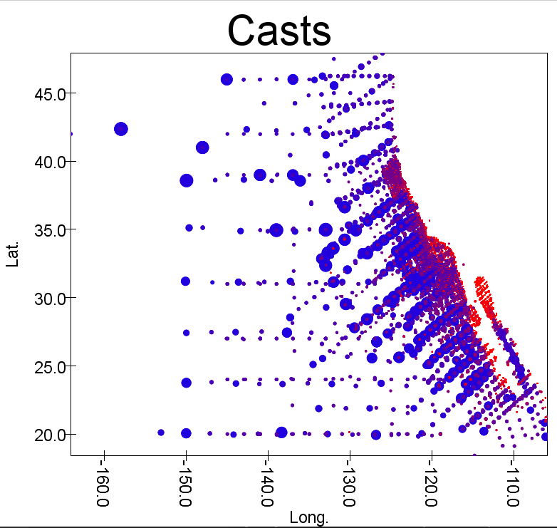
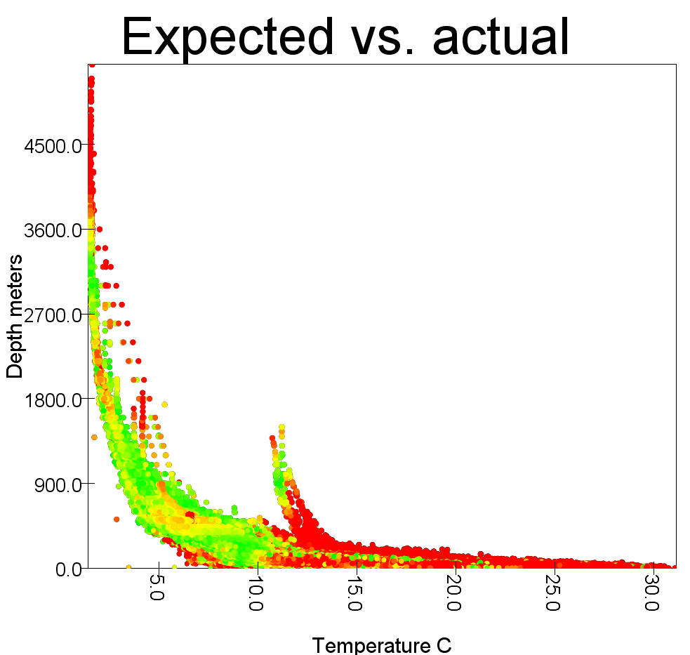

1. How many columns in bottle.csv have more than half the rows non-null? 
    * 36 columns

2. Average bottle count per cast?
    * 25 bottles per cast

3. Plot of casts

Blue represents 0C and red represents 12C

4. Linear Regression of temperature to salinity

    * Average error of 0.279 g/kg

5. Linear regression of temperature, depth, and O2ml_L to salinity

    * Average error of .139 g/kg. 

6. Linear regression with columns of our choosing to predict O2ml_L

I chose to use latitude, longitude and the Julian day to predict O2ml_L. My thinking was that the location and the time of the year would be good indicators, as the season and distance from the shore can affect the water. This gave an average error of 1.849. The minimum O2ml_L value is 0.0, and the maximum is 11.13. 1.849 is probably too big of an average error if you're really wanting to predict O2ml_L. 

7. Plot of findings from #5

I decided to plot the expected values with the actual values. I'm using temperature and depth as the x and y axis. I am excluding O2ml_L because a) I can't plot in 3-D and b) O2ml_L's value ranges from 0 to 11 throughout the dataset, wheres temperature and depth range from 1-31 and 0-5351, respectively. I figured temperature and depth have a larger effect on the salinity, therefore they would be most useful for getting close to a visualization. I tried using size to represent the salinity, but it doesn't really have an effect on the visibility of the graph. 

The color of a dot represents how close it is to the expected value. The average error was 0.13. So if an estimated value has an error of more than 0.26, it is colored red. With an error of 0.13, yellow. If it is close to the actual value, it is green.

I also plot the actual values in black, but they end up getting covered by the colored dots. Either way, I think seeing the error of the predicted values is what matters most. 

Based on this graph, we can see the model is more likely to correclty predict a value if it is within a certain range of temperature and depth. This shows there is a flaw with our model: unless we a predicting salinity of an area that is below 10 degrees C and above 3600 meters depth, we are unlikely to make a good prediction of salinity. 