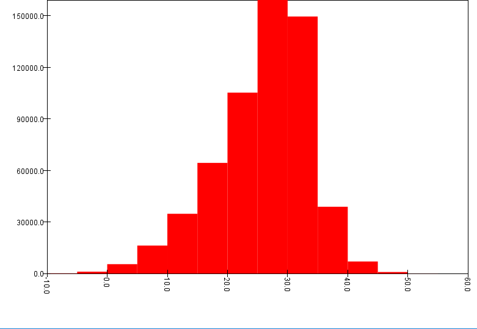
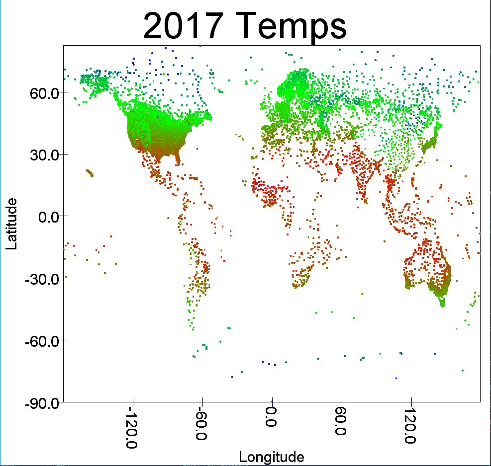

For each question, I have filtered out any reports that have a quality flag.

### 1) What station has reported the largest temperature difference in one day? What, when, and where was it?
    
    Fairbanks, Alaska, February 13th, difference of 49.5 degrees C

    This seems a little extreme. The minimum temperature for this day was -37.8, and the max was 11.7.
    
    Considering this is Alaska, it's likely a snowstorm caused the -37.8, but disappated quickly enough to allow the 11.7 later on in the day. 

### 2) What location has the largest temperature difference over the entire year of 2017?

    Ust-Nera, Russia, difference of 89.2 degrees C.
    
     According to Wikipedia, this is considered one of the coldest permanently inhabited regions on Earth.

    The lowest temperature it recorded in 2017 was -55.7 C, and the highest 33.5 C. This is relatively normal for a subartic climate.  

### 3) Standard deviation for all US max and min temperatures?

     StdDev max: 11.781782062650546 
     StdDev min: 10.540712668387611

### 4) Number of reporters from both 1897 and 2917

    1871

### 5) Temperature variability with latitude

    All stdevs were calculated with the DoubleRDD popStdev() function

    Looking only at TMAX, lat < 35 has 7.738, 35 < lat < 42 has 10.989, and 42 < lat has 12.643.

    Looking at TMAX+TMIN/2, lat < 35 has 7.638, 35 < lat < 42 has 9.664, and 42 < lat has 11.346

    The stdev based on average daily temperature suggests lower levels of variability for each region,
    
    but still shows similar results in how latitude can affect variability. All these numbers seem very

    plausible. 

    X-axis is degrees celsius. Y-axis number of reports.

### 6) Average high temps for 2017

