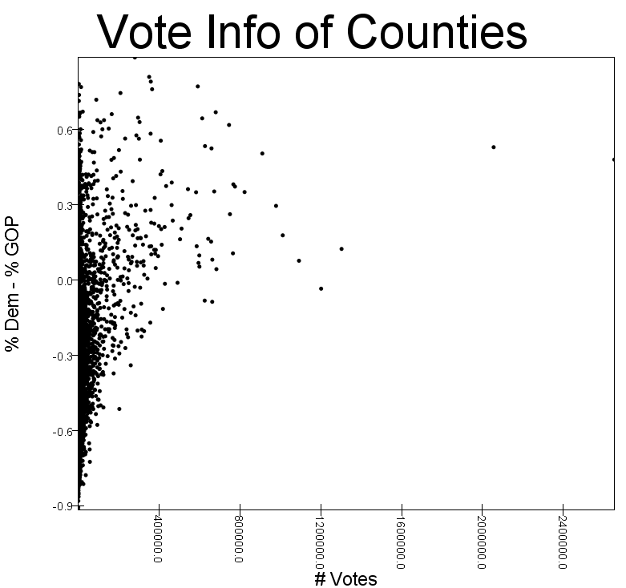
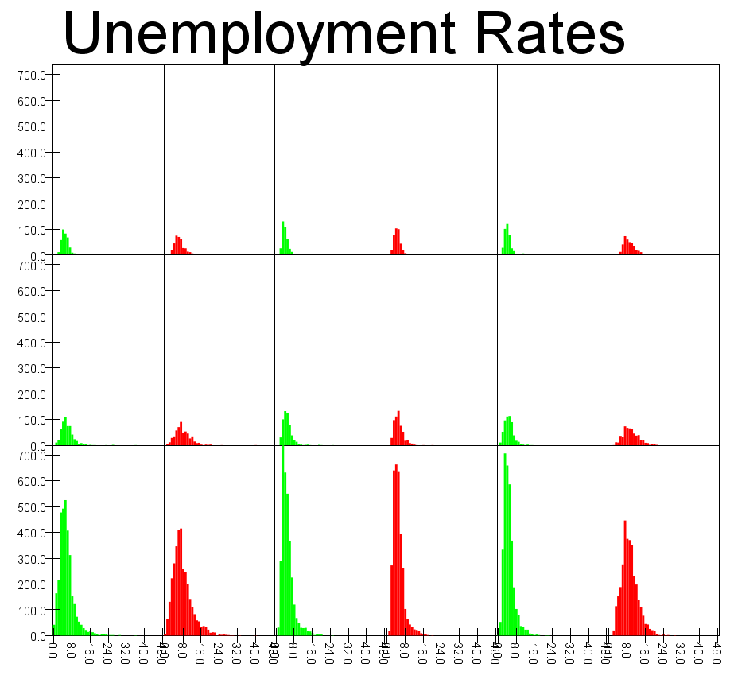
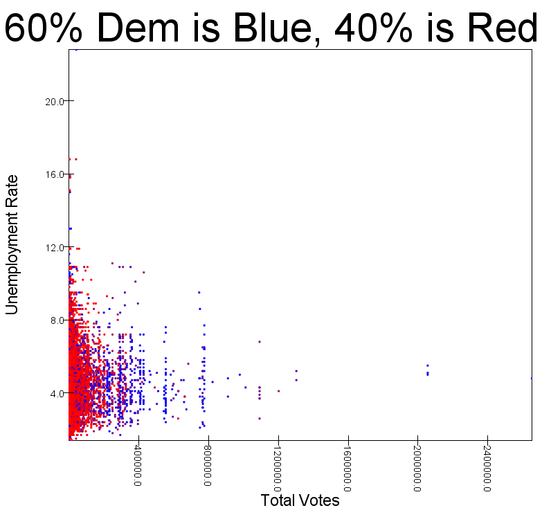
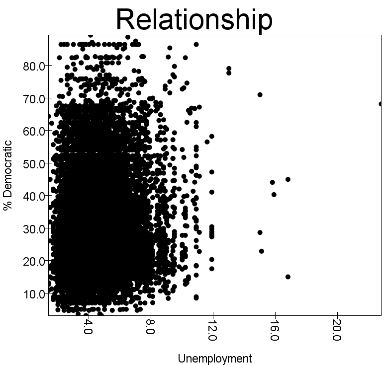

1. Fraction of gop majority counties
    
    * 81% of counties had a GOP majority. I am basing this off the per_gop column being greater than 50%. 
    If I based this off the number of democratic votes being less than the number of GOP votes, the fraction
    would be 84%. 

2. Fraction of counties what went gop by margin of 10% or more? Dems?

    * Gop: 78% of counties won by a margin of 10%.
    * Dem: 21% of counties won by a margin of 10%.

3. Plots

That's not too helpful, so here's another with total votes < 70000

4. 

5. Unemployment Histograms

    * From left to right, the boxes are in chronological order. The first row is metropolitan areas, the second is micropolitan areas, and the third is counties and equivalents.
    * P.S., you should look at how Tony coded this graph. 

6. Correlation between votes and unemployment

    * Correlation of 0.06. To calculate this I used the M13 value, the yearly average of unemployment. Although it does include the month of December, which happened after the election, I thought it would provide a more accurate picture of the correlation. A result of 0.051 implies that the unemployment rate 
    didn't really influence the election. This makes sense since the economy was pretty stable by Nov. 2016; voters cared more about other matters.  

This shows that less populated areas tend to vote Republican. It also shows that the unemployment rate was not a significant factor in this 

election. 

7. Relationships

    * Based on the results from all the previous questions, it seems like the unemployment rates did not influence the election. The number of votes, however, was correlated with the percentage of democratic votes. In general, larger populations voted more democratic. This makes sense, as metropolitan citizens tend to be more democratic and rural citizens do. The plot from question two shows how smaller populations lean Republican. Here is another plot to back me up:

As you can see, there is not much of a trend between unemployment rate and political lean.
