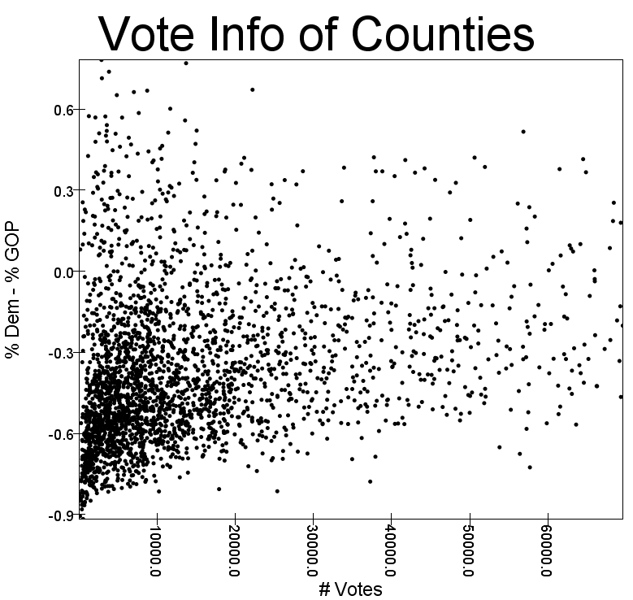

1. Fraction of gop majority counties
    
    * 81% of counties had a GOP majority. I am basing this off the per_gop column being greater than 50%. 
    If I based this off the number of democratic votes being less than the number of GOP votes, the fraction
    would be 84%. 

2. Fraction of counties what went gop by margin of 10% or more? Dems?

    * Gop: 78% of counties won by a margin of 10%.
    * Dem: 21% of counties won by a margin of 10%.

3. Plots

That's not too helpful, so here's another with total votes < 70000

4. Need to fix and upload this 

5. Unemployment Histograms

    * From left to right, the boxes are in chronological order. BDF The first row is metropolitan areas, the second is micropolitan areas, and the third is counties and equivalents.
    * P.S., you should look at how Tony coded this graph. 

